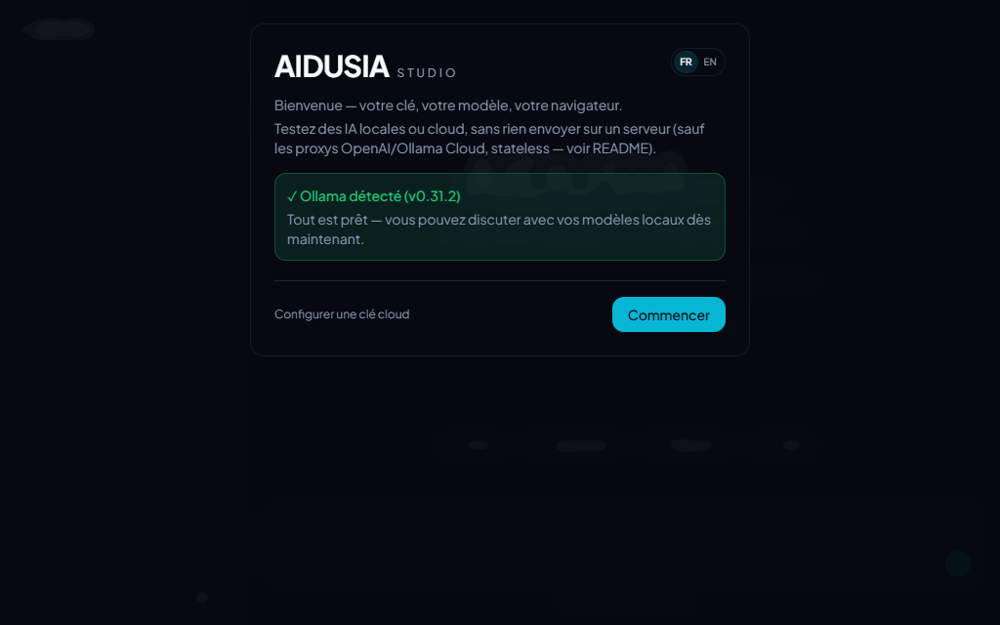

# AIDUSIA Studio

🇫🇷 [Version française](./README.md)

**Try local and cloud AI models straight from your browser — no account, no tracking, with your own keys that never leave your device.**

- 🔑 **Your keys stay with you** — stored in the browser, never on an AIDUSIA server.
- 🖥️ **Local *or* cloud** — Ollama, in-browser AI (WebGPU), or your Anthropic / OpenAI / Grok / … key.
- 🕵️ **No account, no analytics** — open source (AGPL v3), self-hosted fonts and OCR.



> ℹ️ "Stored locally" does not mean "never transmitted": depending on the feature, data may go to a cloud provider, one of the project's proxies, an MCP server, or the browser's speech service. Details below and in [PRIVACY.md](./PRIVACY.md).

## Quick start

```bash
npm install
npm run dev
```

Then choose a mode:

1. **Local Ollama** — install [Ollama](https://ollama.com/download) and use the Studio on a desktop. From a deployed domain, Ollama must allow that origin through `OLLAMA_ORIGINS`.
2. **In-browser AI** — select "On-device." Weights are downloaded on request, cached, then run through WebGPU. Performance varies by browser, GPU, and memory, especially on mobile.
3. **Cloud provider** — add your API key under "Providers." The provider's pricing, quotas, retention, and terms apply.

## Feature status

Legend: ✅ shipped · 🧪 shipped, experimental · ❌ not available

| Feature | Status | Where does data go? |
|---|---|---|
| Local Ollama chat | ✅ | To the configured Ollama URL, usually your machine |
| In-browser AI (WebLLM/WebGPU) | 🧪 (mobile) | Weights downloaded on request; inference on device |
| Anthropic, Gemini, Mistral, OpenRouter, Groq, xAI (Grok) | ✅ | Direct browser → provider connection |
| OpenAI | ✅ | Through `/api/openai/`, then OpenAI |
| Ollama Cloud | ✅ | Through `/api/ollama-cloud/`, then Ollama Cloud |
| Tesseract OCR | ✅ | Local browser processing |
| Image analysis | ✅ (vision-capable Ollama) | Image sent to the configured Ollama instance |
| Web Speech dictation | ✅ (when supported by the browser) | May use a remote browser/OS speech service |
| HTTP MCP connectors | 🧪 | Requests to configured MCP servers |
| Settings export/import | ✅ | Passphrase-encrypted local file |
| Installable PWA and offline shell | ✅ | Application resources cached locally |
| Offline cloud chat | ❌ | A provider connection remains necessary |

API, model, WebGPU, and speech support vary by browser, device, region, and provider. Installing the PWA does not make cloud services available offline.

## Privacy

- Conversations are stored in IndexedDB on this device.
- Keys are held in `sessionStorage` and, by default, also in `localStorage`. Persistent storage can be disabled in the interface.
- No account, analytics, or advertising cookie. Fonts, icons, and OCR files are self-hosted.
- Exported settings are encrypted client-side (AES-GCM, key derived from the passphrase via PBKDF2). Security depends on the strength of that passphrase.

<details>
<summary>When does data leave the device?</summary>

When you send a message to a cloud provider, use dictation, analyze an image with a remote model, or allow an MCP tool, the required data is transmitted. Local browser models are downloaded through the distribution infrastructure used by WebLLM, only when you request them. Full details in [PRIVACY.md](./PRIVACY.md).
</details>

## MCP connectors: security warning

MCP servers add tools that a model can call during a conversation. **Only add trusted servers, using test accounts and least privilege.** Before every call, a confirmation shows the server, tool, a heuristic risk estimate, and a redacted argument preview; declining sends no request.

<details>
<summary>Why the caution, and what the confirmation does not guarantee</summary>

Messages, documents, and tool results can contain prompt injection. An MCP server or tool can also be compromised, misleading, or highly privileged. The confirmation does not guarantee the tool's real effect, and risk classification is heuristic. Local `stdio` servers are unsupported; only remote, CORS-compatible HTTP servers work. See [SECURITY.md](./SECURITY.md).
</details>

## Why are there two proxies?

OpenAI and Ollama Cloud calls go through Edge functions (`api/openai/` and `api/ollama-cloud/`) because those providers block direct browser CORS. These proxies relay the request without intentionally persisting or logging it. Other providers are called directly from the browser.

<details>
<summary>What that code-level property does not guarantee</summary>

The repository code does not persist or log this data, but that alone cannot guarantee the absence of logs at the hosting platform, network, or final provider. You can audit and self-host the proxies.
</details>

## Known limitations

- In-browser AI may download hundreds of megabytes or more and can fail on resource-constrained devices.
- Tesseract targets printed text and generally performs poorly on handwriting.
- Image analysis is currently wired only for Ollama.
- There is no multi-device synchronization, account, or guaranteed commercial support.
- MCP should be treated as experimental: per-action confirmation exists, but risk classification is heuristic and there is no fine-grained persistent permission policy.

## Quality and contributing

```bash
npm run lint       # oxlint
npm test           # unit tests (Vitest)
npm run smoke      # smoke tests (Otsu, throttling)
npm run build      # production build
npm run leak-scan  # secret-leak scan
npm run e2e        # E2E + accessibility (Playwright + Axe)
```

Unit, smoke, and E2E/accessibility tests are integrated into CI. E2E tests require the Playwright browser (`npx playwright install chromium`). See [CONTRIBUTING.md](./CONTRIBUTING.md) and [CHANGELOG.md](./CHANGELOG.md).

## Security

Never publish a key, token, settings export, or conversation in an issue. Follow the reporting process in [SECURITY.md](./SECURITY.md) for vulnerabilities.

## License

GNU AGPL v3 — see [LICENSE](./LICENSE). Code licensing and trademark rights are separate; the repository license does not automatically grant rights to the "AIDUSIA" name.
